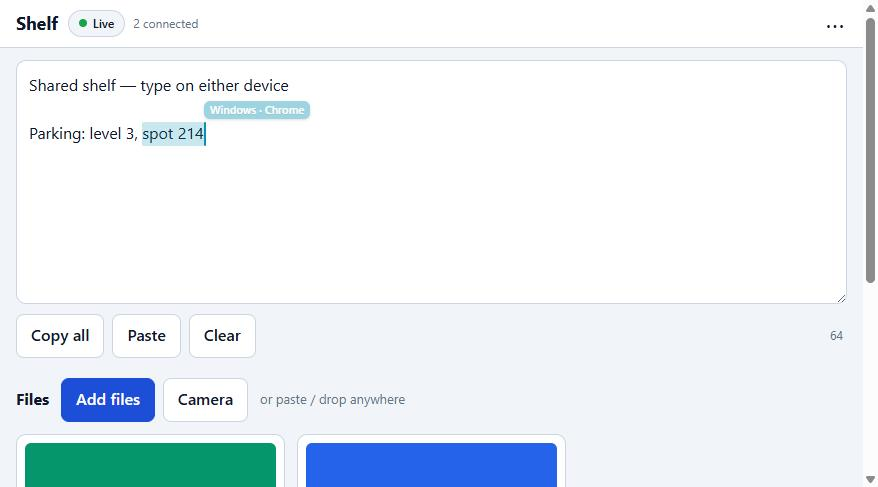
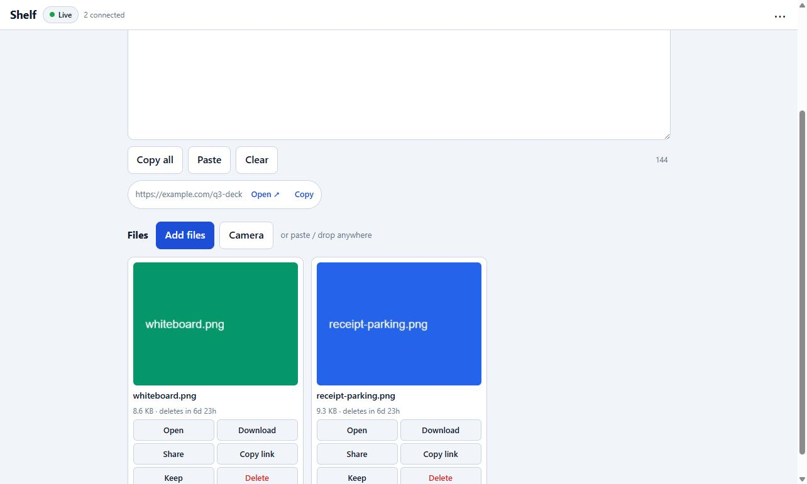

<div align="center">


# Shelf

**One text box and a few files that follow you between your phone and your computer.**

Type on either device and it is on the other within a round trip. Drop, paste, or photograph a file and it is
everywhere, with a thumbnail. Everything behind one password. One container, one volume, no accounts, no cloud.

[](https://github.com/phineasfritsch/shelf/actions/workflows/ci.yml)
[](LICENSE)


[Quick start](#quick-start) · [How it compares](#how-it-compares) · [How it works](#how-it-works) · [Remote access](#access-it-from-anywhere) · [Configuration](docs/configuration.md) · [Security](docs/security.md)

</div>

<div align="center">

<br><sub>A live remote caret and selection from a second device, on the real self-hosted instance.</sub>
</div>

---

## Why

Everyone has a way to move a photo or an address from their phone to their laptop, and every way is bad. You email
it to yourself. You message it to yourself. You plug in a cable. Cloud clipboards want an account and a subscription
and send your clipboard to someone else's server.

Shelf is the boring, private version: a single web page you host yourself. It holds **one live text box** shared
across every device you open it on, and **files that expire on their own** so it never becomes a junk drawer. Open it
on your phone and your laptop, and they are the same shelf.

It is designed to be the thing you set up once and forget: a single ~65 MB container, a single SQLite file, a single
password, no build step, and no request to any third party at runtime.

## Features

- **Live shared text.** Type on any device; the others update within one network round trip — no refresh, no *Save*.
  The box is a [Yjs](https://github.com/yjs/yjs) CRDT, so two devices typing at once **never clobber each other**,
  your **cursor never jumps** when the far side edits, and a device that was offline **merges** its edits on
  reconnect instead of overwriting. Undo only undoes *your* edits. A little history keeps the last snapshots.
- **Live presence.** You see the other device's caret and selection in its own colour, with a "typing…" hint —
  so a shared text box actually *feels* shared, not just eventually consistent.
- **Files that clean up after themselves.** Drag, paste (a screenshot becomes a `.png`), pick, or use the camera.
  Images get thumbnails, generated by the sending browser. Files delete themselves after a week unless you press
  **Keep**. Anything above 8 MiB uploads in parts, so flaky phone networks and proxy body-limits are not a wall.
- **Real auth, no accounts.** One password (`scrypt`-hashed), year-long sessions, per-device revoke, and a QR code
  to log a phone in without typing. Rate limiting, CSRF and WebSocket-origin checks, and a strict CSP are on by default.
- **Phone-first, desktop too.** Installable PWA, home-screen icon, Android share-sheet target, iOS-safe copy and
  paste, big touch targets, keyboard-aware layout, dark mode — and a two-pane layout on a wide screen so the laptop
  half is first-class, not a stretched phone.
- **Boring to run.** One container, one volume, config by environment variable, health check, graceful shutdown,
  logs to stdout. Works on plain `http://` on your LAN and behind Caddy / Traefik / nginx / a Cloudflare Tunnel.

<div align="center">

</div>

## How it compares

Moving things between your own devices is a crowded space, and Shelf is deliberately a different shape from most of it.
The others are **ad-hoc transfer**: open both devices, both awake, and push a file across right now. Shelf is a
**persistent, always-there shelf** — a live text box and a small set of expiring files that are simply *there* whenever
you open the page, on either device, without the other one being awake.

| | Shelf | LocalSend / PairDrop / Snapdrop | Syncthing | A cloud clipboard/notes app |
|---|---|---|---|---|
| Live shared **text box** across devices | ✅ core feature | ❌ | ❌ | sometimes |
| Files that **expire on their own** | ✅ configurable TTL | ❌ (one-shot send) | ❌ (mirrors forever) | rarely |
| Works when the **other device is asleep/offline** | ✅ (it's a server) | ❌ (needs both live) | ⚠️ (needs a peer online) | ✅ |
| **Self-hosted**, your data only | ✅ | ✅ | ✅ | ❌ |
| **No account**, one password | ✅ | ✅ (no auth at all) | ⚠️ (device keys) | ❌ |
| Setup | one container | app per device | app per device + config | signup |

If you want to fling a file from one phone to another in the same room, use LocalSend. If you want a private
always-on scratchpad plus a drop box that both your phone and your laptop share and that tidies itself up, that is Shelf.

## Quick start

You need [Docker](https://docs.docker.com/get-docker/). That is the only requirement.

```bash
git clone https://github.com/phineasfritsch/shelf.git && cd shelf
docker compose up -d --build
docker compose logs -f shelf
```

With nothing configured, the first boot **generates a password and prints it once** in the log (between `====`
lines) and stores only its hash. Open `http://<host>:8080`, log in, and you are done. To set your own password or
change other settings, see [docs/configuration.md](docs/configuration.md).

Once a release is published, you can skip the clone and the build and run the prebuilt image directly:

```bash
docker run -d --name shelf -p 8080:8080 -v shelf-data:/data -e PASSWORD=change-me \
  ghcr.io/phineasfritsch/shelf:latest
```

> **Just want to try it without Docker?** With Node 24+: `npm ci && PASSWORD=test DATA_DIR=./data npm start`, then
> open <http://localhost:8080>. Nothing native compiles — it uses Node's built-in SQLite.

Get your phone on next: open the site there and *Add to Home Screen*, or on the laptop use **⋯ → Link a phone** and
scan the QR code — no password typing on a phone keyboard.

## Access it from anywhere

Shelf serves plain HTTP; something in front of it adds HTTPS and a public name. The easiest, with no port forwarding
and no static IP, is a **Cloudflare Tunnel** (needs a domain on Cloudflare's free plan):

```bash
# in the Cloudflare dashboard: Zero Trust → Networks → Tunnels → Create a tunnel,
# add a public hostname → http://shelf:8080, and copy the token
echo 'TUNNEL_TOKEN=<token>' >> .env
docker compose -f docker-compose.yml -f docker-compose.tunnel.yml up -d --build
```

That override runs the tunnel connector next to Shelf, turns on `Secure` cookies and proxy trust, and stops
publishing the port on the host, so the tunnel is the only door in. Prefer your own domain, Traefik, nginx, or a
private Tailscale mesh instead? All four are in **[docs/deployment.md](docs/deployment.md)**.

## How it works

```
        phone browser  ─┐                            ┌─ one Node process ──────────────────────┐
                        ├── WebSocket (Yjs updates) ──┤  ws + yjs  ·  node:http  ·  node:sqlite   │
      laptop browser  ─┘     HTTPS (files, auth)      │                                          │
                                                      │  /data ──► shelf.db · files/ · text.txt  │
                                                      └──────────────────────────────────────────┘
```

- **The text box is a CRDT, not a diff.** "No lost keystrokes, no clobber on reconnect" is a property of the data
  model rather than of code that has to get a three-way merge right. The server persists each update to SQLite
  *before* it broadcasts or acknowledges it, so a crash between receipt and disk is self-healing on the next sync.
- **The server is a persist-and-relay.** It never transforms text and never parses multipart uploads. Files stream
  straight to disk under random ids with no names or extensions; the browser makes its own thumbnails.
- **No build step, two runtime dependencies.** `ws` and `yjs`. The browser code is hand-written ES modules served
  as-is; `yjs` and a QR generator are pre-bundled into `public/vendor/` and committed. The image is a single
  `node:26-alpine` stage.

The full design is written up in **[docs/SPEC.md](docs/SPEC.md)**; the module-by-module contracts are in
[docs/CONTRACTS.md](docs/CONTRACTS.md).

## Configuration

Everything is an environment variable read once at boot. The essentials:

| Variable | Default | Meaning |
|---|---|---|
| `PASSWORD_HASH` / `PASSWORD_FILE` / `PASSWORD` | — | The password. `PASSWORD_HASH` (from `npm run -s hash-password`) is preferred; with none set, one is generated and printed. |
| `FILE_TTL_HOURS` | `168` | How long a file lives before it deletes itself. `0` = forever. *Keep* exempts a file. |
| `MAX_FILE_MB` / `MAX_STORAGE_MB` | `2048` / `0` | Per-file cap; total cap (`0` = unlimited). |
| `TRUST_PROXY` | `0` | Set `1` behind a reverse proxy or tunnel so the rate limiter sees real client IPs. |
| `COOKIE_SECURE` | `auto` | `auto` adds `Secure` on HTTPS and omits it on LAN http — usually leave it. |

The complete table (20 variables), the password rules, and the on-disk layout are in
**[docs/configuration.md](docs/configuration.md)**.

## Security

Shelf is meant to face the internet behind HTTPS, so this is taken seriously and written down in full in
**[docs/security.md](docs/security.md)**. In short: `scrypt` password; sessions stored only as `sha256(token)`;
`HttpOnly` `SameSite=Lax` cookies with automatic `Secure`; persisted per-IP login limiting plus a global bucket that
can never lock the owner out; `SameSite` + `Origin` + `Content-Type` CSRF layers; WebSocket auth before the handshake
completes; and a strict `Content-Security-Policy` with no inline scripts anywhere. Uploaded files are served
sandboxed, `nosniff`, and inline only for a safe allowlist, so an uploaded HTML or SVG cannot script your session.

It does **not** terminate TLS itself (put a proxy in front for anything past your LAN), has no encryption at rest,
and no per-user separation — everyone with the password shares one shelf, by design.

Found something? Please report it privately: see [SECURITY.md](SECURITY.md).

## Development

```bash
npm ci
PASSWORD=test DATA_DIR=./data npm start     # http://localhost:8080
npm test                                    # node --test, a few seconds, throwaway data dir
```

Node 24+. The rules of the house — zero build step, two runtime dependencies, no inline scripts, single-user scope —
and the repo layout are in **[CONTRIBUTING.md](CONTRIBUTING.md)**. `docs/SPEC.md` §9 is a 27-step manual test script
across two browser windows. Release notes are in **[CHANGELOG.md](CHANGELOG.md)**.

## Non-goals

Shelf is deliberately small. It is **not** a multi-user app, a Dropbox, or a notes app: no accounts, no sharing
between different people, no folders, no rich text, no public share links. If you want those, fork it — the code is
short and the design doc explains every seam.

## License

[MIT](LICENSE) © Phineas Fritsch. Built with [Yjs](https://github.com/yjs/yjs) and [ws](https://github.com/websockets/ws).
